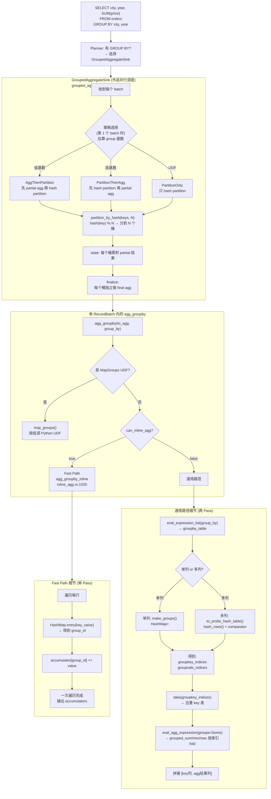
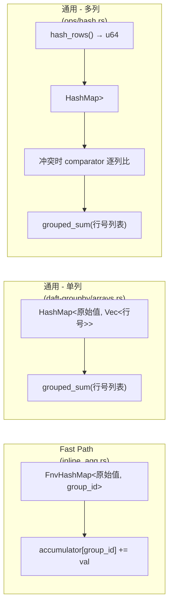
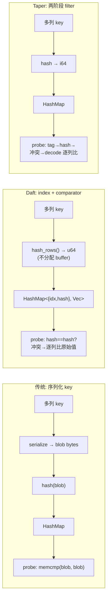

# Daft Hash Aggregation 总体设计流程

## 总览



---

## 三条 Hash 路径的核心区别



---

## 多列路径 probe 流程（核心设计）

```mermaid
flowchart TD
    ROW["输入: row i, columns=(city, year, price)"]
    ROW --> HASH["hash_rows(): 合并 city+year 的 hash\n→ h = xxHash3(city[i]) combine xxHash3(year[i])\n→ 一个 u64 整数"]

    HASH --> PROBE["probe HashMap: raw_entry_mut().from_hash(h, ...)"]
    PROBE --> SLOT{"slot 状态?"}

    SLOT -->|空 slot| INSERT["Vacant: 插入\nIndexHash{idx:i, hash:h} → [i]\n新建一个 group"]

    SLOT -->|有值| CMP{"比较:\n1. h == slot.hash? (整数比较)"}
    CMP -->|hash 不等| NEXT["继续 probe 下一个 slot"]
    CMP -->|hash 相等| FULL_CMP{"2. comparator(row_i, row_j)\ncity[i]==city[j]?\nyear[i]==year[j]?"}

    FULL_CMP -->|不等 (hash 冲突)| NEXT
    FULL_CMP -->|相等 (同一个 group)| PUSH["Occupied: push row_i\n行号追加到该 group 的 Vec"]

    style INSERT fill:#d4edda
    style PUSH fill:#d4edda
    style NEXT fill:#fff3cd
```

关键：**不序列化**。HashMap key 存的是 `{行号, hash}`，不是序列化后的 bytes。
相等判断回查原始列数据，不做 memcmp。

---

## 与传统序列化 Hash Agg 对比



| 维度 | 传统序列化 | Daft | Taper |
|------|-----------|------|-------|
| Probe 分配内存 | 每行序列化 blob | 零 | 零 |
| HashMap key 大小 | 变长 blob | 16 bytes (idx+hash) | 8 bytes (i64) |
| 相等判断 | memcmp | 逐列比原始值 | tag→hash→decode 比 |
| 适合场景 | 简单通用 | 中小规模数据 | 超高吞吐 |

---

## 代码文件对应

| 层级 | 文件 | 职责 |
|------|------|------|
| 算子调度 | `daft-local-execution/src/sinks/grouped_aggregate.rs` | batch 接收、策略、partition、finalize |
| RecordBatch agg | `daft-recordbatch/src/ops/agg.rs` | `agg_groupby` 入口 + 通用路径 |
| Fast path | `daft-recordbatch/src/ops/inline_agg.rs` | 单 pass hash+accumulate |
| 分组 (单列) | `daft-groupby/src/arrays.rs` | `make_groups` HashMap |
| 分组 (多列) | `daft-recordbatch/src/ops/hash.rs` | `to_probe_hash_table` + comparator |
| 分组 (入口) | `daft-recordbatch/src/ops/groups.rs` | `RecordBatch::make_groups` |
| Hash 计算 | `daft-core/src/kernels/hashing.rs` | xxHash3_64 逐列 hash |
| Per-group 聚合 | `daft-core/src/array/ops/sum.rs` | `grouped_sum` 按索引 fold |
