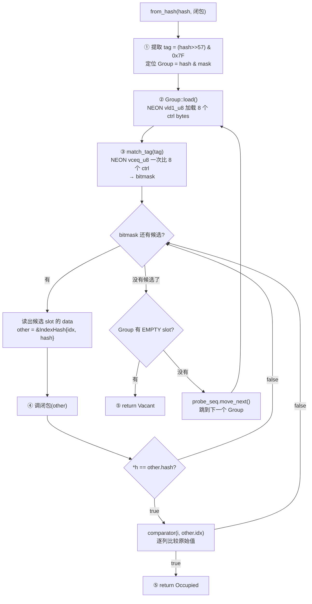

# `from_hash` 内部流程图

## 一次 `from_hash(*h, 闭包)` 调用的完整执行过程

```
输入: hash = 0x7A3F1B02C4E89F30, 闭包 = |other| { (*h == other.hash) && comparator(i, other.idx) }

┌─────────────────────────────────────────────────────────────────────────────┐
│ from_hash 内部 (hashbrown)                                                   │
├─────────────────────────────────────────────────────────────────────────────┤
│                                                                             │
│  ① 提取 tag 和定位 Group                                                     │
│  ┌───────────────────────────────────────────────────────┐                 │
│  │ tag (h2) = (0x7A3F1B02C4E89F30 >> 57) & 0x7F = 0x3D  │                 │
│  │ group_idx = hash & mask = ... → Group 5               │                 │
│  └───────────────────────────────────────────────────────┘                 │
│                            │                                                │
│                            ▼                                                │
│  ② 加载 Group 5 的 ctrl bytes (NEON vld1_u8)                                │
│  ┌───────────────────────────────────────────────────────┐                 │
│  │ Group 5 内存:                                          │                 │
│  │                                                       │                 │
│  │ ctrl bytes (8 个):                                     │                 │
│  │ ┌────┬────┬────┬────┬────┬────┬────┬────┐            │                 │
│  │ │0x3D│0x58│0x80│0x3D│0x80│0x80│0x80│0x80│            │                 │
│  │ │ ↑  │    │empt│ ↑  │empt│empt│empt│empt│            │                 │
│  │ │slot│slot│    │slot│                    │            │                 │
│  │ │ 0  │ 1  │    │ 3  │                    │            │                 │
│  │ └────┴────┴────┴────┴────┴────┴────┴────┘            │                 │
│  │                                                       │                 │
│  │ data slots:                                           │                 │
│  │ slot 0: IndexHash{idx:0, hash:0x7A3F1B02C4E89F30}     │                 │
│  │ slot 1: IndexHash{idx:1, hash:0xB1D2E4A700000058}     │                 │
│  │ slot 2: (empty)                                       │                 │
│  │ slot 3: IndexHash{idx:4, hash:0x7A3F1B02DEADBEEF}     │                 │
│  │ slot 4-7: (empty)                                     │                 │
│  └───────────────────────────────────────────────────────┘                 │
│                            │                                                │
│                            ▼                                                │
│  ③ SIMD 比较 tag (NEON vceq_u8)                                             │
│  ┌───────────────────────────────────────────────────────┐                 │
│  │ 目标 tag = 0x3D                                        │                 │
│  │                                                       │                 │
│  │ vdup_n_u8(0x3D):  [3D][3D][3D][3D][3D][3D][3D][3D]   │                 │
│  │ ctrl bytes:       [3D][58][80][3D][80][80][80][80]    │                 │
│  │                                                       │                 │
│  │ vceq_u8 结果:     [FF][00][00][FF][00][00][00][00]    │                 │
│  │                    ↑match      ↑match                 │                 │
│  │                    slot 0      slot 3                  │                 │
│  │                                                       │                 │
│  │ → bitmask = {slot 0, slot 3}                          │                 │
│  │ → 只有这两个 slot 需要进一步检查                         │                 │
│  │ → 其他 6 个 slot: 跳过, 不调闭包                        │                 │
│  └───────────────────────────────────────────────────────┘                 │
│                            │                                                │
│                            ▼                                                │
│  ④ 遍历 bitmask 中的候选 slot                                               │
│                                                                             │
│  ┌─── 候选 1: slot 0 ────────────────────────────────────┐                 │
│  │                                                       │                 │
│  │ other = &data[slot 0]                                 │                 │
│  │       = &IndexHash{idx:0, hash:0x7A3F1B02C4E89F30}    │                 │
│  │                                                       │                 │
│  │ 调闭包:                                                │                 │
│  │ ┌───────────────────────────────────────────────┐     │                 │
│  │ │ *h == other.hash?                              │     │                 │
│  │ │ 0x7A3F1B02C4E89F30 == 0x7A3F1B02C4E89F30     │     │                 │
│  │ │ → true ✓                                       │     │                 │
│  │ │                                               │     │                 │
│  │ │ comparator(i=2, j=other.idx=0):               │     │                 │
│  │ │   city[2] == city[0]?                          │     │                 │
│  │ │   "Beijing" == "Beijing" → true ✓              │     │                 │
│  │ │   year[2] == year[0]?                          │     │                 │
│  │ │   2023 == 2023 → true ✓                        │     │                 │
│  │ │ → true ✓                                       │     │                 │
│  │ └───────────────────────────────────────────────┘     │                 │
│  │                                                       │                 │
│  │ 闭包返回 true → 找到了! 不看 slot 3 了                  │                 │
│  └───────────────────────────────────────────────────────┘                 │
│                            │                                                │
│                            ▼                                                │
│  ⑤ 返回结果                                                                 │
│  ┌───────────────────────────────────────────────────────┐                 │
│  │ return Occupied(slot 0)                                │                 │
│  └───────────────────────────────────────────────────────┘                 │
│                                                                             │
└─────────────────────────────────────────────────────────────────────────────┘

Daft 收到: RawEntryMut::Occupied(entry)
  → entry.get_mut().push(2 as u64)  // 把 row 2 加到这个 group 的行号列表里
```

---

## 如果闭包返回 false 的情况 (hash 碰撞)

```
假设 row 5 进来: ("Tokyo", 2025), hash = 0x7A3F1B02DEADBEEF
tag = (0x7A3F1B02DEADBEEF >> 57) & 0x7F = 0x3D  ← 碰巧和 slot 0, slot 3 的 tag 一样!

SIMD tag 比较 → bitmask = {slot 0, slot 3}

候选 1: slot 0
  other = IndexHash{idx:0, hash:0x7A3F1B02C4E89F30}
  闭包:
    *h == other.hash?
    0x7A3F1B02DEADBEEF == 0x7A3F1B02C4E89F30
    → false ✗ (hash 不同!)
    → 短路, 不调 comparator
  闭包返回 false → 继续下一个候选

候选 2: slot 3
  other = IndexHash{idx:4, hash:0x7A3F1B02DEADBEEF}
  闭包:
    *h == other.hash?
    0x7A3F1B02DEADBEEF == 0x7A3F1B02DEADBEEF
    → true ✓
    comparator(5, 4):
      city[5] == city[4]?
      "Tokyo" == "Beijing" → false ✗
    → comparator 返回 false
  闭包返回 false → 继续

bitmask 耗尽, 没有更多候选
检查: group.match_empty().any_bit_set()?
  ctrl 里有 0x80 (empty) → true
  → 返回 Vacant

Daft 收到: RawEntryMut::Vacant(entry)
  → 插入新 group
```

---

## 流程图 (mermaid)



---

## 关键: 谁做什么

| 步骤 | 谁做的 | 代码位置 |
|------|--------|---------|
| ① 提取 tag, 定位 Group | hashbrown | raw/mod.rs `find_inner` |
| ② 加载 ctrl bytes | hashbrown (NEON) | control/group/neon.rs `Group::load` |
| ③ SIMD tag 比较 | hashbrown (NEON) | control/group/neon.rs `match_tag` |
| ④ 比 hash | Daft 闭包 | ops/hash.rs `*h == other.hash` |
| ④ 比原始 key | Daft 闭包 | ops/hash.rs `comparator(i, j)` |
| ⑤ 返回结果 | hashbrown | raw_entry.rs |
