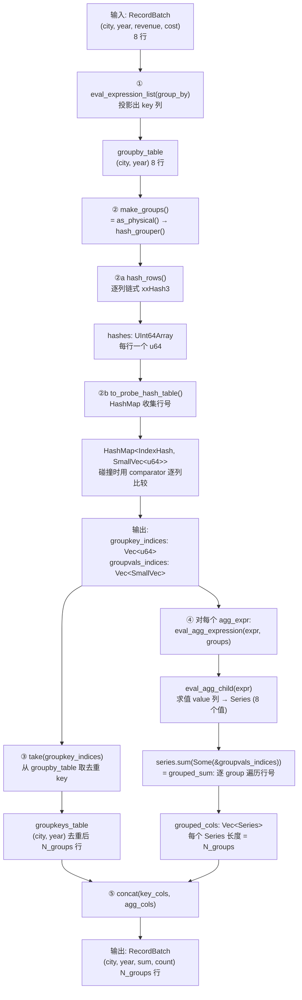

# General Path: GroupBy Aggregation 流程详解

## 总览流程图



---

## 具体例子

### 输入

```
RecordBatch (8 行):
row | city       | year | revenue
----|------------|------|--------
 0  | "Beijing"  | 2023 | 100
 1  | "Shanghai" | 2024 | 200
 2  | "Beijing"  | 2023 | 150
 3  | "Shanghai" | 2024 | 300
 4  | "Beijing"  | 2024 | 50
 5  | "Shanghai" | 2023 | 400
 6  | "Beijing"  | 2023 | 75
 7  | "Shanghai" | 2024 | 125

group_by = [col("city"), col("year")]
to_agg   = [Sum("revenue"), Count("revenue")]
```

---

## ① eval_expression_list(group_by)

**做什么**: 把原始 RecordBatch 投影到 group_by 指定的列（如果有表达式会计算）

**输入**: 原始 RecordBatch + group_by 表达式列表

**输出**: `groupby_table: RecordBatch`

```
groupby_table (8 行, 2 列):
row | city       | year
----|------------|-----
 0  | "Beijing"  | 2023
 1  | "Shanghai" | 2024
 2  | "Beijing"  | 2023
 3  | "Shanghai" | 2024
 4  | "Beijing"  | 2024
 5  | "Shanghai" | 2023
 6  | "Beijing"  | 2023
 7  | "Shanghai" | 2024
```

行数不变，列数 = group_by 表达式数量。

---

## ② make_groups()

### ②a hash_rows()

**做什么**: 对 groupby_table 的每行，把所有列的值组合成一个 u64 hash

**算法**: 链式 hash — 第一列独立 hash，后续每列以前一列的 hash 为 seed

```rust
hash_so_far = cols[0].hash(None)?;       // city 列 hash
hash_so_far = cols[1].hash(Some(&hash_so_far))?;  // year 列 hash，以 city hash 为 seed
```

**输出**: `hashes: UInt64Array` (每行一个 u64)

```
row | city       | year | hash
----|------------|------|------------
 0  | "Beijing"  | 2023 | 0x7A3F1B02
 1  | "Shanghai" | 2024 | 0xB1D2E4A7
 2  | "Beijing"  | 2023 | 0x7A3F1B02  ← 和 row 0 相同
 3  | "Shanghai" | 2024 | 0xB1D2E4A7  ← 和 row 1 相同
 4  | "Beijing"  | 2024 | 0xC4E89F30
 5  | "Shanghai" | 2023 | 0xD5F1A643
 6  | "Beijing"  | 2023 | 0x7A3F1B02  ← 和 row 0 相同
 7  | "Shanghai" | 2024 | 0xB1D2E4A7  ← 和 row 1 相同
```

### ②b to_probe_hash_table()

**做什么**: 遍历 hashes，用 HashMap 把相同 key 的行号收集到一起

**数据结构**: `HashMap<IndexHash, SmallVec<[u64; 2]>, IdentityBuildHasher>`

- `IndexHash { idx: u64, hash: u64 }` — HashMap 的 key
- `SmallVec<[u64; 2]>` — HashMap 的 value（该 group 的行号列表）
- IdentityBuildHasher — hash 已经算好，直接用 hash 值作为桶地址

**逐行 probe 过程**:

```
row 0: hash=0x7A3F → 桶空 → Vacant
       插入 IndexHash{idx:0, hash:0x7A3F} → value=[0]

row 1: hash=0xB1D2 → 桶空 → Vacant
       插入 IndexHash{idx:1, hash:0xB1D2} → value=[1]

row 2: hash=0x7A3F → 桶有 entry!
       碰撞检查: hash 相等 ✓
       comparator(row2, row0):
         city[2]=="Beijing" == city[0]=="Beijing" ✓
         year[2]==2023 == year[0]==2023 ✓
       → Occupied → value=[0] 变成 value=[0, 2]

row 3: hash=0xB1D2 → 碰撞 → comparator(row3, row1) ✓
       → value=[1] 变成 value=[1, 3]

row 4: hash=0xC4E8 → 桶空 → Vacant
       插入 IndexHash{idx:4, hash:0xC4E8} → value=[4]

row 5: hash=0xD5F1 → 桶空 → Vacant
       插入 IndexHash{idx:5, hash:0xD5F1} → value=[5]

row 6: hash=0x7A3F → 碰撞 → comparator(row6, row0) ✓
       → value=[0, 2] 变成 value=[0, 2, 6]

row 7: hash=0xB1D2 → 碰撞 → comparator(row7, row1) ✓
       → value=[1, 3] 变成 value=[1, 3, 7]
```

**HashMap 最终状态**:

```
┌─────────────────────────────────────────────────────────┐
│ Key (IndexHash)              │ Value (SmallVec<u64>)     │
├─────────────────────────────────────────────────────────┤
│ {idx:0, hash:0x7A3F}        │ [0, 2, 6]                 │  ← Beijing+2023
│ {idx:1, hash:0xB1D2}        │ [1, 3, 7]                 │  ← Shanghai+2024
│ {idx:4, hash:0xC4E8}        │ [4]                       │  ← Beijing+2024
│ {idx:5, hash:0xD5F1}        │ [5]                       │  ← Shanghai+2023
└─────────────────────────────────────────────────────────┘
```

**拆分为输出**:

```
groupkey_indices = [0, 1, 4, 5]          // 每个 entry 的 idx 字段

groupvals_indices = [
  SmallVec[0, 2, 6],   ← group 0 的所有行号 (Beijing+2023)
  SmallVec[1, 3, 7],   ← group 1 的所有行号 (Shanghai+2024)
  SmallVec[4],          ← group 2 的所有行号 (Beijing+2024)
  SmallVec[5],          ← group 3 的所有行号 (Shanghai+2023)
]
```

**内存消耗**: 每行一个 u64 行号 (8 bytes) = 8×8 = 64 bytes，加上 4 个 SmallVec 头部。

---

## ③ take(groupkey_indices)

**做什么**: 从 groupby_table 按 `[0, 1, 4, 5]` 取出去重的 key 行

**输出**: `groupkeys_table: RecordBatch`

```
groupkeys_table (4 行):
row | city       | year
----|------------|-----
 0  | "Beijing"  | 2023    (原 row 0)
 1  | "Shanghai" | 2024    (原 row 1)
 2  | "Beijing"  | 2024    (原 row 4)
 3  | "Shanghai" | 2023    (原 row 5)
```

这就是最终输出的 key 列。

---

## ④ eval_agg_expression (逐 agg 表达式)

### 单 group 优化判断

```rust
let group_idx_input = if groupvals_indices.len() == 1 {
    None      // 只有 1 个 group → 传 None → 全局聚合（快）
} else {
    Some(&groupvals_indices)   // 多 group → 传行号列表
};
```

本例有 4 个 group，走 `Some` 分支。

### Sum("revenue")

```
Step 1: eval_agg_child("revenue")
  → 从原始 RecordBatch 取 revenue 列 (直接引用，无拷贝)
  → Series: [100, 200, 150, 300, 50, 400, 75, 125]

Step 2: series.sum(Some(&groupvals_indices))
  → 调用 grouped_sum(&self, groups)
```

**grouped_sum 内部** (无 null 分支):

```rust
groups.iter().map(|g| {
    g.iter().fold(0i64, |acc, &index| {
        acc + self.get(index as usize).unwrap()
    })
})
```

逐 group 展开：

```
Group 0: indices=[0, 2, 6]
  get(0)=100, get(2)=150, get(6)=75
  fold: 0 + 100 + 150 + 75 = 325

Group 1: indices=[1, 3, 7]
  get(1)=200, get(3)=300, get(7)=125
  fold: 0 + 200 + 300 + 125 = 625

Group 2: indices=[4]
  get(4)=50
  fold: 0 + 50 = 50

Group 3: indices=[5]
  get(5)=400
  fold: 0 + 400 = 400

输出: DataArray<Int64> → Series [325, 625, 50, 400]
```

### Count("revenue")

```
Step 1: eval_agg_child("revenue") → 同上

Step 2: series.count(Some(&groupvals_indices), CountMode::All)
  → grouped_count
```

**grouped_count** (CountMode::All, 无 null):

```
Group 0: indices=[0, 2, 6] → len = 3
Group 1: indices=[1, 3, 7] → len = 3
Group 2: indices=[4]       → len = 1
Group 3: indices=[5]       → len = 1

输出: Series<UInt64> [3, 3, 1, 1]
```

### 汇总

```
grouped_cols = [
  Series<Int64>  [325, 625, 50, 400],    // sum
  Series<UInt64> [3, 3, 1, 1],           // count
]
```

---

## ⑤ 拼接输出

```rust
let all_columns = [groupkeys_series, grouped_cols].concat();
Self::from_nonempty_columns(all_columns)
```

```
最终 RecordBatch (4 行, 4 列):

city       | year | revenue(sum) | revenue(count)
-----------|------|--------------|---------------
"Beijing"  | 2023 | 325          | 3
"Shanghai" | 2024 | 625          | 3
"Beijing"  | 2024 | 50           | 1
"Shanghai" | 2023 | 400          | 1
```

---

## 内存和性能分析

### 中间数据大小 (以 N=8 行, G=4 groups 为例)

| 数据结构 | 大小 |
|---------|------|
| `hashes: UInt64Array` | N × 8 = 64 bytes |
| `HashMap` entries | G × (IndexHash=16 + SmallVec header=24) = 160 bytes |
| SmallVec 里的行号 | N × 8 = 64 bytes (总共存 N 个 u64) |
| `groupkey_indices` | G × 8 = 32 bytes |
| 合计 groupvals_indices | N × 8 + G × overhead ≈ **8 bytes/行** |

当 N = 100M 行时：行号列表 ≈ 800MB。

### 随机访问问题

`grouped_sum` 对每个 group 按行号做 `get(idx)`：

```
Group 0: get(0), get(2), get(6)  — 跳着读
Group 1: get(1), get(3), get(7)  — 跳着读
```

如果 group 数量多且分布均匀，每个 `get(idx)` 可能命中不同的 cache line，导致 L1/L2 cache miss。

### 多 agg 重复遍历

如果有 3 个聚合 (sum, count, min)：
- value 列被 `eval_agg_child` 求值 3 次（如果是简单列引用则只是引用不拷贝）
- `groupvals_indices` 被遍历 3 次
- 每次都按行号随机访问 value 列

---

## 代码位置索引

| 步骤 | 函数 | 文件 |
|------|------|------|
| ① eval_expression_list | `RecordBatch::eval_expression_list` | `src/daft-recordbatch/src/lib.rs` |
| ② make_groups | `RecordBatch::hash_grouper` | `src/daft-recordbatch/src/ops/groups.rs` |
| ②a hash_rows | `RecordBatch::hash_rows` | `src/daft-recordbatch/src/ops/hash.rs` |
| ②b probe hash table | `RecordBatch::to_probe_hash_table` | `src/daft-recordbatch/src/ops/hash.rs` |
| ③ take | `RecordBatch::take` | `src/daft-recordbatch/src/lib.rs` |
| ④ eval_agg_expression | `RecordBatch::eval_agg_expression` | `src/daft-recordbatch/src/lib.rs` |
| ④ grouped_sum | `DaftSumAggable::grouped_sum` | `src/daft-core/src/array/ops/sum.rs` |
| ④ grouped_count | `DaftCountAggable::grouped_count` | `src/daft-core/src/array/ops/count.rs` |
| ⑤ from_nonempty_columns | `RecordBatch::from_nonempty_columns` | `src/daft-recordbatch/src/lib.rs` |

---

## 类型签名参考

```rust
// make_groups 的输出类型
pub type VecIndices = SmallVec<[u64; 2]>;
pub type GroupIndices = Vec<VecIndices>;           // = Vec<SmallVec<[u64; 2]>>
pub type Indices = Vec<u64>;
pub type GroupIndicesPair = (Indices, GroupIndices);
//                           ↑ groupkey_indices    ↑ groupvals_indices

// probe hash table 的类型
HashMap<IndexHash, VecIndices, IdentityBuildHasher>
// IndexHash = { idx: u64, hash: u64 }
// VecIndices = SmallVec<[u64; 2]>  (该 group 的所有行号)

// hash_rows 输出
UInt64Array  // 长度 = 行数，每个元素是该行的 hash 值

// eval_agg_expression 签名
fn eval_agg_expression(
    &self,
    agg_expr: &BoundAggExpr,
    groups: Option<&GroupIndices>,  // None = 全局聚合, Some = 分组聚合
) -> DaftResult<Series>
```
