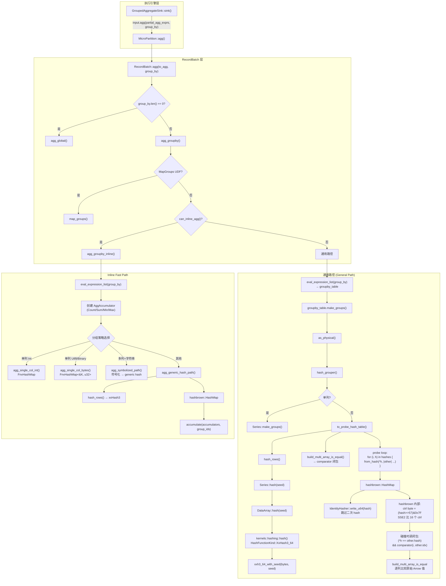

# Hash Aggregation 调用链

## 全景图



---

## 文本版调用链

### 通用路径 (General Path)

```
GroupedAggregateSink::sink()
  → MicroPartition::agg(partial_agg_exprs, group_by)
    → RecordBatch::agg(to_agg, group_by)                     [ops/agg.rs]
      → RecordBatch::agg_groupby(to_agg, group_by)           [ops/agg.rs]
        → eval_expression_list(group_by)                       [lib.rs]
            输出: groupby_table (只含 key 列)
        → groupby_table.make_groups()                          [ops/groups.rs]
          → self.as_physical()?.hash_grouper()
            → [多列] self.to_probe_hash_table()                [ops/hash.rs]
              ├── self.hash_rows()                              [ops/hash.rs:14]
              │   └── Series::hash(seed)                       [series/ops/hash.rs:12]
              │       └── DataArray::hash(seed)                [array/ops/hash.rs:40]
              │           └── kernels::hashing::hash()         [kernels/hashing.rs:304]
              │               └── hash_primitive_inner<XxHash3>
              │                   └── xxh3_64_with_seed(val.to_le_bytes(), seed)
              │
              ├── build_multi_array_is_equal(cols, cols)        [array/ops/arrow/comparison.rs]
              │   输出: comparator: Fn(usize, usize) -> bool
              │
              └── probe loop:                                   [ops/hash.rs:50-70]
                  for (i, h) in hashes.values().iter().enumerate() {
                    probe_table.raw_entry_mut().from_hash(*h, |other| {
                      (*h == other.hash)                        ← Stage 1: hash ==
                      && comparator(i, other.idx as usize)     ← Stage 2: 逐列比较
                    })
                    → Vacant:  insert IndexHash{idx:i, hash:*h} → SmallVec[i]
                    → Occupied: push i to SmallVec
                  }
                  输出: HashMap<IndexHash, SmallVec<[u64;2]>>

            → [单列] Series::make_groups()                     [daft-groupby/src/series.rs]

        → take(groupkey_indices) → groupkeys_table
        → for agg_expr in to_agg:
            eval_agg_expression(expr, Some(&groupvals_indices)) [lib.rs:712]
              → eval_agg_child(expr) → Series
              → series.sum(Some(&groups))                       [series/ops/agg.rs]
                → grouped_sum(&self, groups)                    [array/ops/sum.rs]
        → concat(groupkeys_table, grouped_cols)
```

### Inline Fast Path

```
RecordBatch::agg_groupby(to_agg, group_by)                    [ops/agg.rs]
  → can_inline_agg(to_agg, self) == true
  → RecordBatch::agg_groupby_inline(to_agg, group_by)         [ops/inline_agg.rs]
    → eval_expression_list(group_by) → groupby_table
    → as_physical() → groupby_physical
    → try_create_accumulator(agg_expr) → AggAccumulator
    → 分组策略选择:
      ├── [单列 Int8-64/UInt8-64]
      │   → agg_single_col_int(keys, accumulators)
      │     └── FnvHashMap<T::Native, u32>
      │         (FNV-1a hash, 原始值做 key, 无 comparator)
      │
      ├── [单列 Utf8/Binary]
      │   → agg_single_col_bytes(len, null_count, value_at, ...)
      │     └── FnvHashMap<&str, u32> / FnvHashMap<&[u8], u32>
      │         (FNV-1a hash, 借用切片做 key, 无 comparator)
      │
      ├── [多列 + 有长字符串]
      │   → agg_symbolized_path(groupby_physical, accumulators)
      │     ├── symbolize_column() × N  (FnvHashMap 分配 symbol id)
      │     └── agg_generic_hash_path(symbolized_rb, accumulators)
      │
      └── [其他]
          → agg_generic_hash_path(groupby_physical, accumulators)
            ├── hash_rows() → xxHash3 逐列链式
            ├── build_multi_array_is_equal → comparator
            └── probe loop:
                HashMap<IndexHash, u32, IdentityBuildHasher>
                → GroupingResult { groupkey_indices, group_ids, group_sizes }

    → accumulate(accumulators, &GroupingResult)
      for each acc:
        acc.init_groups(num_groups)
        if !acc.try_use_group_sizes(&group_sizes):  // Count O(groups) 捷径
          acc.update_batch(&group_ids)              // O(rows) scatter

    → acc.finalize(name) → Series
    → take(groupkey_indices) → groupkeys_table
    → concat(groupkeys_table, agg_series) → 输出
```

---

## 关键数据结构在调用链中的位置

| 数据结构 | 定义位置 | 在哪创建 | 在哪使用 |
|---------|---------|---------|---------|
| `IndexHash {idx, hash}` | `daft-core/src/utils/identity_hash_set.rs` | `ops/hash.rs` probe loop 的 Vacant 分支 | hashbrown 桶定位 + 闭包比较 |
| `IdentityBuildHasher` | `daft-core/src/utils/identity_hash_set.rs` | HashMap 初始化时 | hashbrown 内部，跳过二次 hash |
| `UInt64Array` (hashes) | `daft-core/datatypes` | `hash_rows()` 返回 | probe loop 遍历 |
| `comparator` 闭包 | `build_multi_array_is_equal` 返回 | `to_probe_hash_table` / `agg_generic_hash_path` | probe loop 碰撞时调用 |
| `GroupingResult` | `ops/inline_agg.rs` | 分组完成后构造 | `accumulate()` 消费 |
| `AggAccumulator` enum | `ops/inline_agg.rs` | `try_create_accumulator` | `accumulate()` → `finalize()` |

---

## 源文件索引

| 文件 | 主要函数 |
|------|---------|
| `src/daft-local-execution/src/sinks/grouped_aggregate.rs` | GroupedAggregateSink::sink/finalize |
| `src/daft-recordbatch/src/ops/agg.rs` | agg, agg_groupby, agg_global |
| `src/daft-recordbatch/src/ops/inline_agg.rs` | can_inline_agg, agg_groupby_inline, agg_generic_hash_path, accumulate |
| `src/daft-recordbatch/src/ops/groups.rs` | make_groups, hash_grouper |
| `src/daft-recordbatch/src/ops/hash.rs` | hash_rows, to_probe_hash_table |
| `src/daft-core/src/utils/identity_hash_set.rs` | IndexHash, IdentityHasher |
| `src/daft-core/src/array/ops/hash.rs` | DataArray::hash, hash_with |
| `src/daft-core/src/kernels/hashing.rs` | hash(), hash_primitive_inner (xxHash3) |
| `src/daft-core/src/array/ops/arrow/comparison.rs` | build_multi_array_is_equal |
| `src/daft-core/src/array/ops/sum.rs` | grouped_sum |
| `src/daft-core/src/series/ops/agg.rs` | Series::sum, count, min, max |
