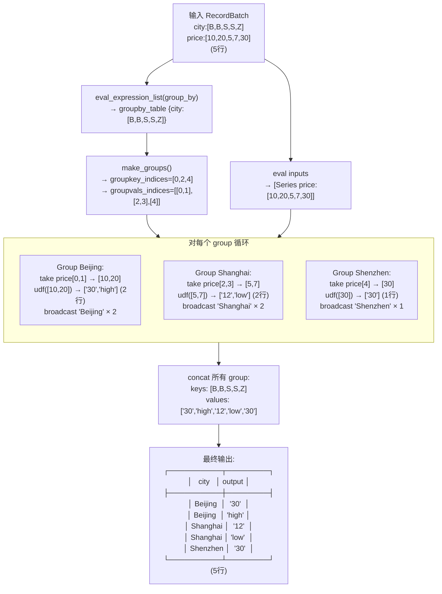

# Daft map_groups 逐行数据流

## 示例

```python
df.groupby("city").map_groups(my_udf, col("price"))
```

输入:
```
┌──────────┬───────┐
│   city   │ price │
├──────────┼───────┤
│ Beijing  │  10   │ row 0
│ Beijing  │  20   │ row 1
│ Shanghai │   5   │ row 2
│ Shanghai │   7   │ row 3
│ Shenzhen │  30   │ row 4
└──────────┴───────┘
```

假设 UDF 行为：`my_udf(prices) → [sum(prices), "label"]` (每组返回 2 行)

---

## 逐行代码 + 数据变化

```rust
// 输入: self = RecordBatch {city:[B,B,S,S,Z], price:[10,20,5,7,30]} (5行)
//       func = my_udf
//       inputs = [col("price")]
//       group_by = [col("city")]

let groupby_table = self.eval_expression_list(group_by)?;
// → groupby_table = RecordBatch {city: ["Beijing","Beijing","Shanghai","Shanghai","Shenzhen"]} (5行)

let (groupkey_indices, groupvals_indices) = groupby_table.make_groups()?;
// → groupkey_indices = [0, 2, 4]
// → groupvals_indices = [[0,1], [2,3], [4]]

let evaluated_inputs = inputs.iter().map(|e| self.eval_expression(e)).collect()?;
// → evaluated_inputs = [Series("price"): [10, 20, 5, 7, 30]]
```

---

### 多 group 循环（核心）

```rust
// 对每个 group 执行:
for (groupkey_index, groupval_indices) in zip([0,2,4], [[0,1],[2,3],[4]]):
```

---

#### Group 0: Beijing (groupkey_index=0, groupval_indices=[0,1])

```rust
let indices_as_arr = UInt64Array::from_vec("", [0, 1]);
// → Arrow 数组 [0, 1]

let input_groups = evaluated_inputs.iter()
    .map(|s| s.take(&indices_as_arr)).collect()?;
// → price.take([0,1]) = Series [10, 20]
// → input_groups = [Series [10, 20]]

let evaluated_grouped_col = udf.call_udf(input_groups)?;
// → my_udf([10, 20]) → Series ["30", "high"]  (UDF 返回了 2 行!)

let groupkey_indices_as_arr = UInt64Array::from_slice("", &[0]);
let groupkeys_table = groupby_table.take(&groupkey_indices_as_arr)?;
// → groupby_table.take([0]) = {city: ["Beijing"]}  (1 行)

// broadcast key 到 UDF 输出的行数 (2 行)
let broadcasted_groupkeys = groupkeys_table.columns.iter()
    .map(|c| c.broadcast(2)).collect()?;
// → city: ["Beijing"] broadcast 成 ["Beijing", "Beijing"]

// 结果: ({city:["Beijing","Beijing"]}, Series["30","high"])
```

---

#### Group 1: Shanghai (groupkey_index=2, groupval_indices=[2,3])

```rust
// price.take([2,3]) → [5, 7]
// my_udf([5, 7]) → Series ["12", "low"]  (2 行)
// groupby_table.take([2]) → {city: ["Shanghai"]}
// broadcast 成 ["Shanghai", "Shanghai"]
// 结果: ({city:["Shanghai","Shanghai"]}, Series["12","low"])
```

---

#### Group 2: Shenzhen (groupkey_index=4, groupval_indices=[4])

```rust
// price.take([4]) → [30]
// my_udf([30]) → Series ["30"]  (1 行)
// groupby_table.take([4]) → {city: ["Shenzhen"]}
// broadcast 1 行 → ["Shenzhen"] (不变)
// 结果: ({city:["Shenzhen"]}, Series["30"])
```

---

### Concat 所有 group

```rust
let concatenated_grouped_col = Series::concat([
    Series["30","high"],   // Beijing
    Series["12","low"],    // Shanghai
    Series["30"],          // Shenzhen
])?;
// → Series ["30","high","12","low","30"]  (5 行)

let concatenated_groupkeys_table = RecordBatch::concat([
    {city:["Beijing","Beijing"]},
    {city:["Shanghai","Shanghai"]},
    {city:["Shenzhen"]},
])?;
// → {city: ["Beijing","Beijing","Shanghai","Shanghai","Shenzhen"]}  (5 行)
```

---

### 拼接最终输出

```rust
let final_columns = [groupkeys_series, &[grouped_col]].concat();
Self::new_with_broadcast(final_schema, final_columns, final_len)
// → RecordBatch:
//   ┌──────────┬────────┐
//   │   city   │ output │
//   ├──────────┼────────┤
//   │ Beijing  │  "30"  │
//   │ Beijing  │ "high" │
//   │ Shanghai │  "12"  │
//   │ Shanghai │ "low"  │
//   │ Shenzhen │  "30"  │
//   └──────────┴────────┘
//   (5 行)
```

---

## 流程图



---

## 关键设计点

| 问题 | 解答 |
|------|------|
| 为什么要 broadcast group key? | UDF 每组可以返回任意行数，需要 key 列对齐 |
| 为什么不能做 partial/final 两阶段? | UDF 是黑盒，必须看到完整组才能计算 |
| GroupedAggregateSink 怎么配合? | 使用 `AggStrategy::PartitionOnly`，只 hash partition 保证同 key 同桶 |
| 空组怎么办? | `groupvals_indices.is_empty()` → 直接返回空表 |
| 只有 1 个组? | 优化：不做 take，直接把整个输入传给 UDF |

---

## 代码位置

| 代码 | 位置 |
|------|------|
| `map_groups` 入口 | `src/daft-recordbatch/src/ops/agg.rs` (约 line 65) |
| `make_groups` | `src/daft-groupby/src/arrays.rs:40` |
| `take` | RecordBatch 按索引取行 |
| `broadcast` | Series 广播到指定长度 |
| `Series::concat` | 纵向拼接多个 Series |
| `RecordBatch::concat` | 纵向拼接多个表 |
